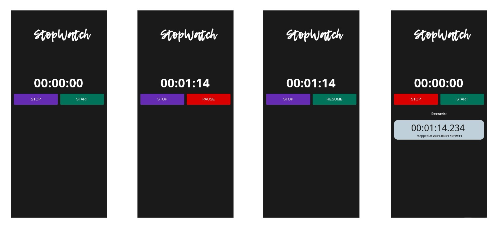

# **StopWatch**

*Android app to simulate a **StopWatch** and that also saves records into an API created with [JsonBin](https://jsonbin.io//).*

<p align="center">

</p>

## Features

- The application should provide the ability to start the stopwatch which will start measuring time from 0 until stop or pause of the application. Measure the time in milliseconds.
- The application should provide the ability to stop the time measurement. Stop will reset the counter to 0.
- The application should provide the ability to pause the counter and when the start is pressed again, the application will continue to measure the time from that moment.
- When the user presses the stop button, the application should synchronize the counted value. The application should send the JSON value to the provided API.
- The application should use shared preferences to increase the performance and to reduce the number of network calls.
- Display synchronized data in the application, preferably with a recycler view.

## Architecture

We will be using the **Architecture Components** approach of the [Android Jetpack](https://developer.android.com/jetpack/) libraries. This means extensive use of the **MVVM** pattern and **reactive programming**. The controller interfaces will be implemented in `ViewModel` classes, views will be represented for their respective `Fragments` and models will be wrapped inside `LiveData` objects. LiveData and ViewModels classes are **lifecycle-aware** and they allow the use of **Observer** pattern to handle the app state.  As a plus, these LiveData objects are **thread-safe** and we can exploit this capacity to create **asynchronous requests** to the API to improve performance. With this architecture, our code gains clearness and separation of concerns (with the help of `dependency inversion`) so this facilitates the usage of **TDD**. If possible, we will try to apply `dependency injection` using **Hilt** to improve the quality of code and tests.

In order to maintain the app smooth and because the timer counters is a CPU-bound task, we need to use **parallelism** in our solution. To achieve that, we will implement a **kotlin-coroutines** approach. 

For the `API` requests we will use the **Retrofit** library and for data `persistence`, we are going to use **Shared Preferences** due to its simplicity and as part of a `cache` strategy. The corresponding ViewModel will retrieve the records from the appropriate source(API or cache) in every case, through a `repository` pattern. 

To get an effective decoupling of the views, the **Data Binding** and **View Binding** libraries will be helpful. Therefore, the views will be `single responsibility` compliance and lightweight in the resources usage.

In the UI, we will be using **Material Desing** components mostly. For the list of logs, we select the RecyclerView as is more effective than ListView or similars. Finally, we will try to create `animations` that provide a better UI/UX by using **Motion Layouts**.

Unit testing will be made in `junit4` and instrumented testing in `Espresso`, the mocking will use `mockk` library.

## Tasks

- [X] Define the schema for API endpoints.
- [X] Setting basic app structure and resources.
- [X] Create the StopWatch logic using ViewModel and Bindings.
- [/] Unit tests for stopwatch logic and formatting operations.
- [/] Espresso tests for basic components.
- [X] Setup API client and basic CRD operations.
- [X] Make asynchronous requests to the API.
- [X] Prepare API responses.
- [X] Create the RecyclerView for records.
- [ ] Create the records flow using a Repository pattern.
- [ ] Send the record values to the API and notify UI.
- [ ] Implement a cache system using SharedPreferences.
- [ ] Add more tests to have good coverage.


## *Extras*

- [ ] Multiple screen support.
- [ ] Delete records.
- [ ] Apply dependency injection.
- [ ] Animations.

## API Schema

```
{
  "type": "object",
  "properties": {
    "logs": {
      "type": "array",
      "items": [
        {
          "type": "object",
          "uniqueItems": true,
          "required": [
            "datetime",
            "time"
          ],
          "additionalProperties": false,
          "properties": {
            "datetime": {
              "type": "string",
              "format": "date-time",
              "default": "2021-02-26T09:25:23.112+0000"
            },
            "time": {
              "type": "string"
            }
          }
        },
        {
          "type": "object",
          "properties": {
            "datetime": {
              "type": "string"
            },
            "time": {
              "type": "string"
            }
          },
          "required": [
            "datetime",
            "time"
          ]
        }
      ]
    }
  },
  "required": [
    "logs"
  ]
}
```