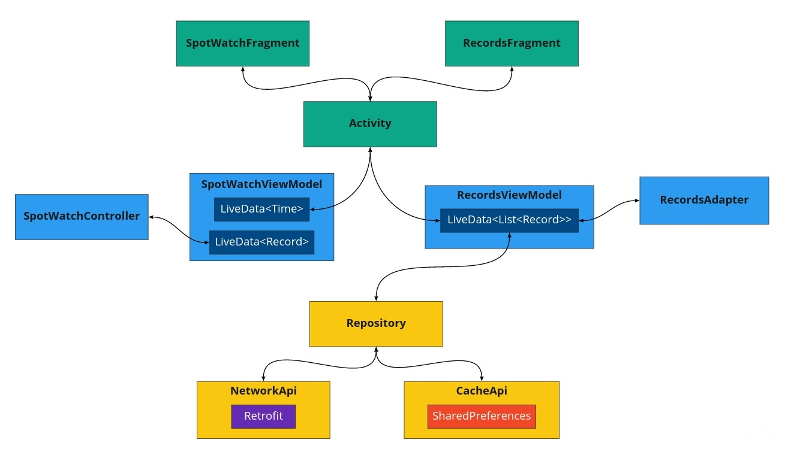

# **StopWatch**

*Android app to simulate a **StopWatch** and that also saves records into an API created with [JsonBin](https://jsonbin.io//).*

<p align="center">

</p>

<p align="center">


</p>

## Features

- The application should provide the ability to start the stopwatch which will start measuring time from 0 until stop or pause of the application. Measure the time in milliseconds.
- The application should provide the ability to stop the time measurement. Stop will reset the counter to 0.
- The application should provide the ability to pause the counter and when the start is pressed again, the application will continue to measure the time from that moment.
- When the user presses the stop button, the application should synchronize the counted value. The application should send the JSON value to the provided API.
- The application should use shared preferences to increase the performance and to reduce the number of network calls.
- Display synchronized data in the application, preferably with a recycler view.

## Architecture

<p align="center">

</p>

We will be using the **Architecture Components** approach of the [Android Jetpack](https://developer.android.com/jetpack/) libraries. This means extensive use of the **MVVM** pattern and **reactive programming**. The controller interfaces will be implemented in `ViewModel` classes, views will be represented for their respective `Fragments` and models will be wrapped inside `LiveData` objects. LiveData and ViewModels classes are **lifecycle-aware** and they allow the use of **Observer** pattern to handle the app state.  As a plus, these LiveData objects are **thread-safe** and we can exploit this capacity to create **asynchronous requests** to the API to improve performance. 

With this architecture, our code gains clearness and separation of concerns (with the help of `dependency inversion`) so this facilitates the usage of **TDD**. If possible, we will try to apply `dependency injection` using **Hilt** to improve the quality of code and tests.

In order to maintain the app smooth and because the timer counters is a CPU-bound task, we need to use **parallelism** in our solution. To achieve that, we will implement a **kotlin-coroutines** approach. 

For the `API` requests we will use the **Retrofit** library and for `data persistence`, we are going to use **Shared Preferences** due to its simplicity and as part of a `cache` strategy. The corresponding ViewModel will retrieve the records from the appropriate source(API or cache) in every case, through a `repository` pattern. 

To get a nice decoupling of modules, besides the project structure, it will be helpful to use **Data Binding** and **View Binding**. This way, the views are more lightweight and `single responsibility` compliant.

In the UI we will be using **Material Design**, and for the list of records, we select a `RecyclerView` and `CardView` components. Finally, we will try to create `animations` to provide a better UI/UX by using **Motion Layouts**.

Unit testing will be made in `junit4` and instrumented testing in `Espresso`, the mocking will use `mockk` library.

## Tasks

- [X] Define the schema for API endpoints.
- [X] Setting basic app structure and resources.
- [X] Create the StopWatch logic using ViewModel and Bindings.
- [X] Basic Unit Tests for business logic.
- [X] Basic Espresso Tests.
- [X] Setup API client and operations.
- [X] Make asynchronous requests to the API.
- [X] Prepare API responses.
- [X] Create the RecyclerView for records.
- [X] Implement a cache system using SharedPreferences.
- [X] Save the records using a Repository pattern.
- [X] Send the records to the API.
- [X] Handle exceptions.
- [X] Delete records with Swipe gesture.
- [X] Validate correct functioning of all requirements in the app.

## *Extras*

- [X] CI with Github Actions.
- [ ] Notify errors and states.
- [X] Multiple screen support.
- [X] Animations.
- [ ] Apply dependency injection.
- [ ] Improve the test harness for better coverage.
- [ ] Synchronize records between Cache with API.

## API Schema

The API schema created with [JsonBin](https://jsonbin.io//) basically defines an array of objects with two properties (datetime and time) and it looks as follows:

```
{
  "type": "object",
  "properties": {
    "logs": {
      "type": "array",
      "items": [
        {
          "type": "object",
          "uniqueItems": true,
          "required": [
            "datetime",
            "time"
          ],
          "additionalProperties": false,
          "properties": {
            "datetime": {
              "type": "string",
              "format": "date-time",
              "default": "2021-02-26T09:25:23.112+0000"
            },
            "time": {
              "type": "string"
            }
          }
        },
        {
          "type": "object",
          "properties": {
            "datetime": {
              "type": "string"
            },
            "time": {
              "type": "string"
            }
          },
          "required": [
            "datetime",
            "time"
          ]
        }
      ]
    }
  },
  "required": [
    "logs"
  ]
}
```

## Final Considerations

Some considerations described as follows were adopted because of the timing constraints and characteristics of the project:

- **Cache Strategy**
 
The synchronization between the operations with records in the Network API and Cache was designed for simplicity and to keep a small number of records visible in the list. The app will **only save** the records to the Network API after the Stop button is pressed and, on the other hand, it will `save`, `get` and `delete` records in the Cache API. This way so the app will maintain it states properly and it looks better. 

Although to records fully synchronized between both data sources, a more complicated cache strategy would be necessary. There are several cache strategies to choose yet for this particular example, we think the better approach is a **write through** strategy, this will keep records consistently and will assure data is always in cache when the UI is restored, as this is an important performance issue in Android apps.

- **Background Work**

Both the StopWatch and the API requests are * heavy work * to do in the background and that way, ensure the app performance.  We will seize coroutines for this requirement and will try to adapt this behavior with the `repository` pattern on top of the model layer to keep the separation of concerns and guarantee the testability of the modules.

- **StopWatch Precision**

The StopWatch was implemented with a **Handler-Runnable** technique. This might be not the best option to have strict precision in the timing counter, plus UI re-drawing and **Android OS** could be playing against us. According to the investigation made for this app, our solution is acceptable and also has been used in some of the most popular StopWatch apps in the market store, but surely there is room for improvement in this topic.

